 🏪 StoreCRM — Smart Store Management System (WPF)

**StoreCRM** is a Windows Presentation Foundation (WPF)-based CRM system designed for businesses and stores that need an efficient and user-friendly tool to manage customers, products, invoices, users, and daily activities — all in one place.

---

## 🚀 Key Features

### 📊 1. Dynamic Dashboard
- Real-time display of **date**, **time**, and **user information**
- Shows daily sales, total customers, and active reminders
- Dynamic and data-driven overview

---

### 👥 2. Customer Management
- Add new customers with **name** and **phone number**
- Advanced and filtered search options
- Edit or delete existing customer data

---

### 📦 3. Product Management
- Add, edit, or delete products
- Filter and search products easily
- Track inventory and categories

---

### 🧾 4. Invoice Management
- Create and print new invoices for registered customers and products
- Apply discounts and print via **Stimulsoft Reports**
- Advanced invoice searching by filters or date range

---

### 🕒 5. Activity Management
- Log user activities with custom categories
- Add reminders for each activity
- Search activities by phone number, username, or category

---

### ⏰ 6. Reminder System
- Add reminders for specific dates and times
- Filter and search reminders

---

### 🔐 7. User & Access Management
- Create new users with custom access levels
- Define **user groups** with specific permissions
 

---

### 💬 8. SMS Panel
- Send SMS notifications and reminders directly from the system

---

### 📈 9. Reporting
- Generate and print reports for different categories and time ranges
- Export reports using **Stimulsoft**

---

### ⚙️ 10. System Settings
- Manage activity categories
- Configure global system preferences and permissions

---

## 🖼️ Demo & Screenshots

🎥 **Demo Video:**  
[🎥 Watch Demo Video on Google Drive](https://drive.google.com/file/d/1a9_7JuQSfREbNf2MC07RufSFkJWHe_TZ/view?usp=sharing)

🖼️ **Screenshots:**
| Dashboard | Customer Management | Invoice | Activity | Categories | Exit | Login | Product Management | Reminder | Reports |SMS Panel | Users+Access Roles |
|------------|--------------------|----------|
| 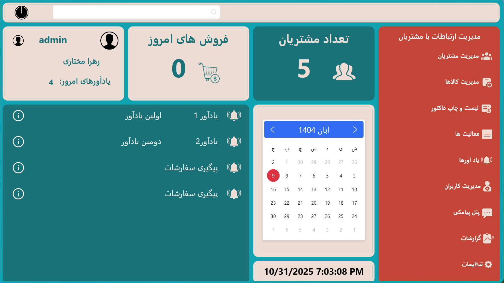 | 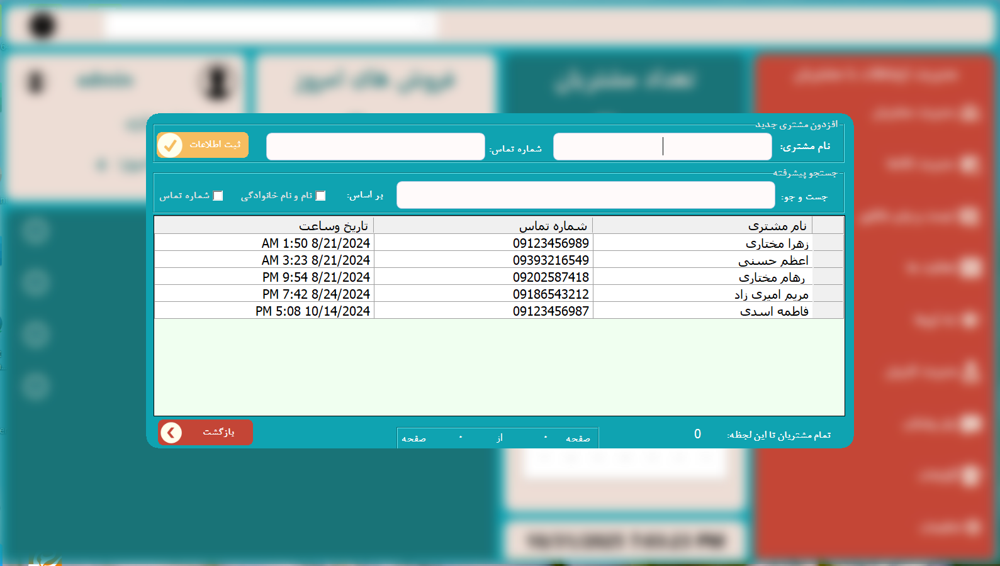 | 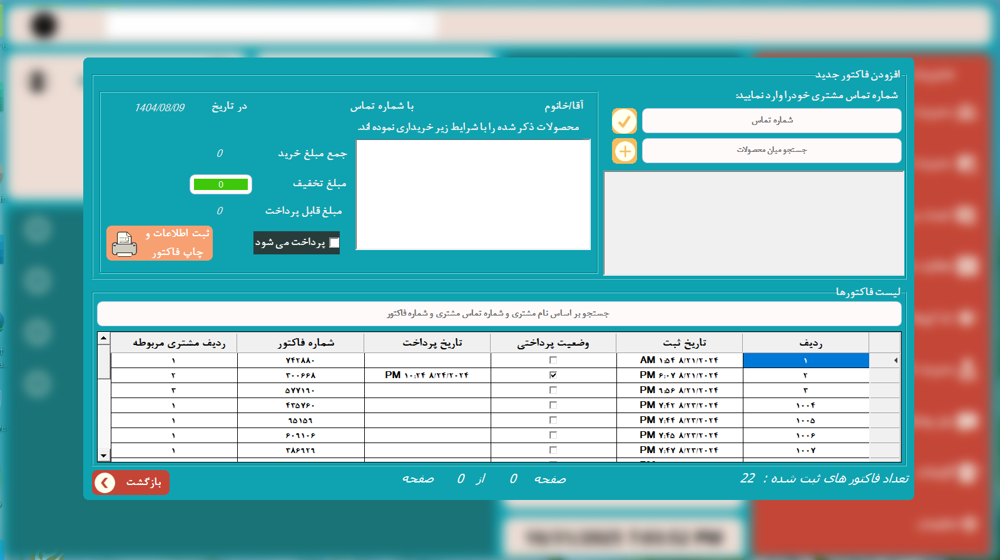 | 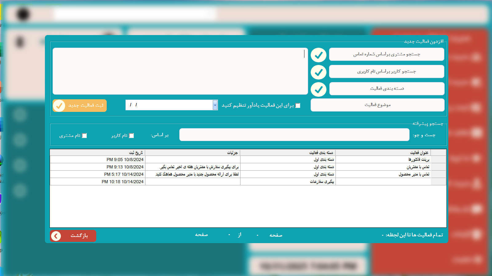  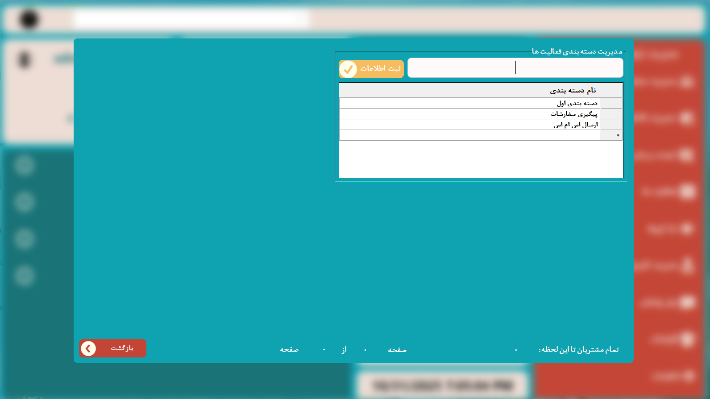  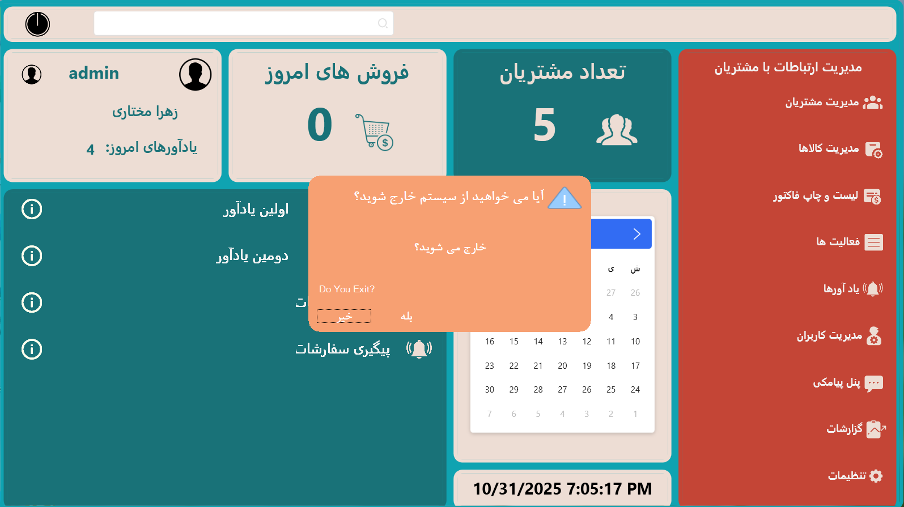  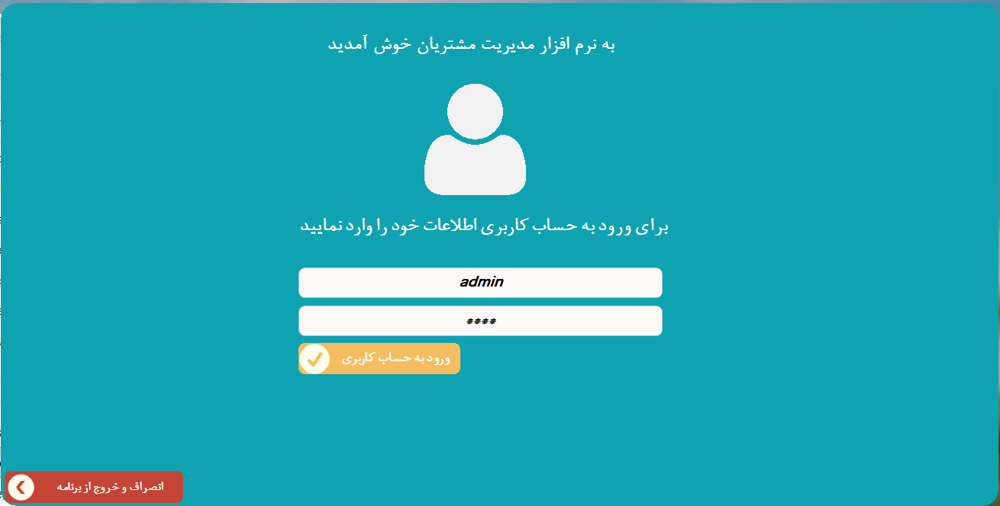  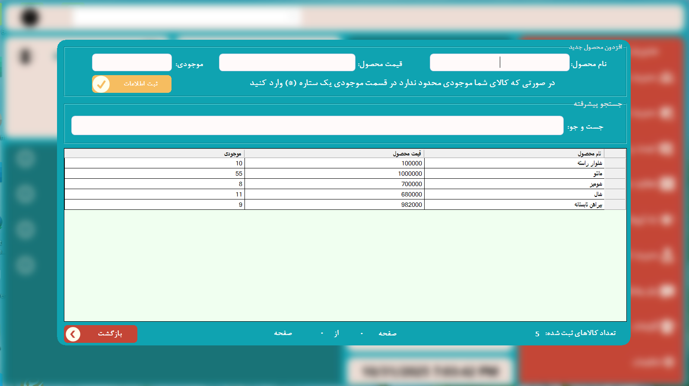  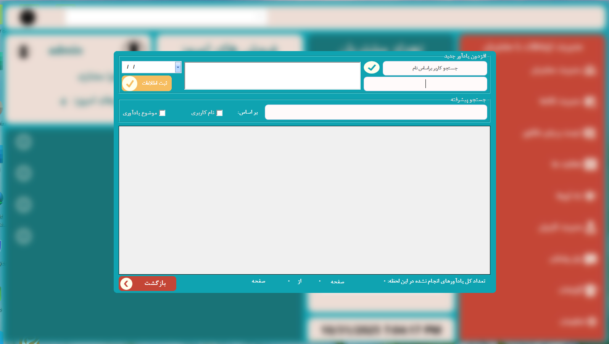  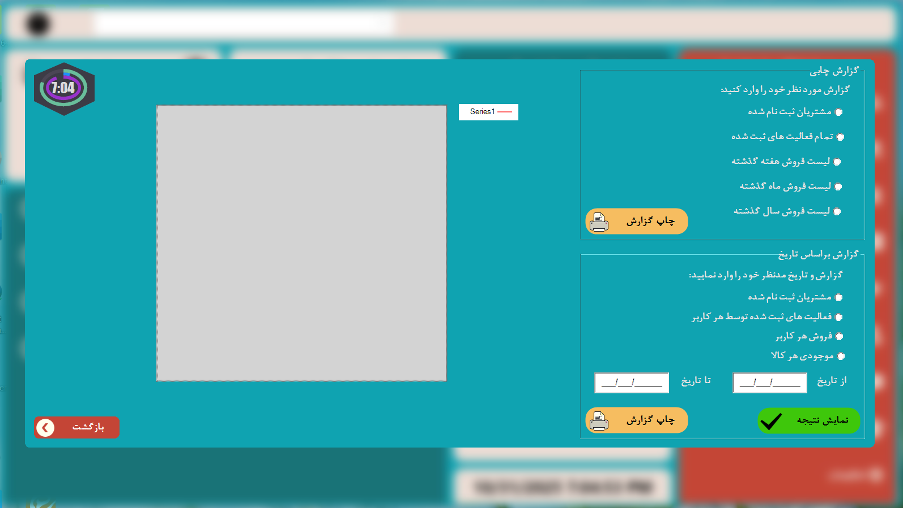  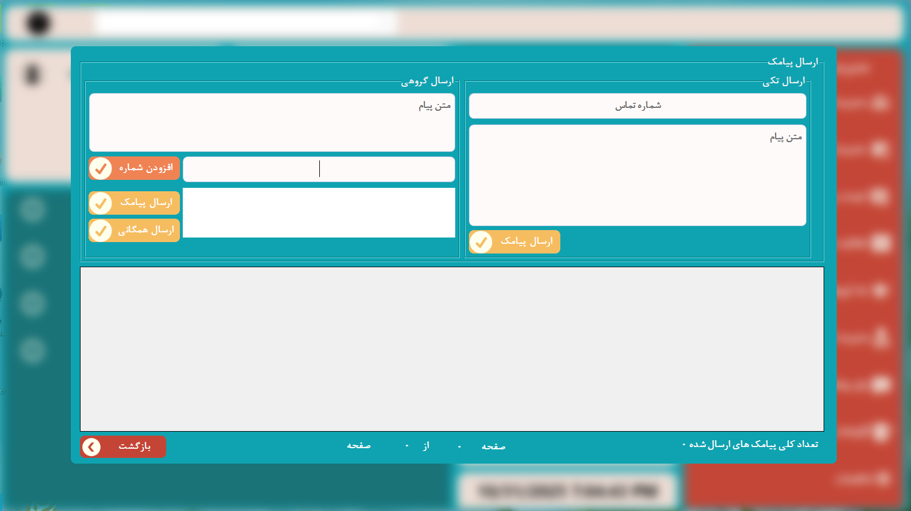  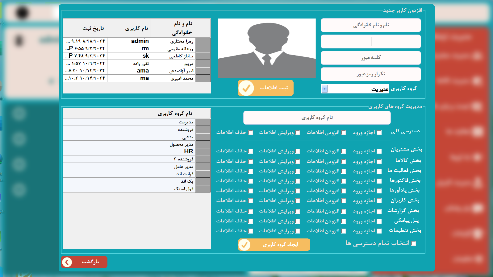 

---

## 🔒 Project Type

> **Closed Source Demo** — The source code and executable file are stored in a private repository for security reasons.  
> This public repository is only for showcasing the demo, screenshots, and documentation.

---

## 🧑‍💻 Technology Stack

| Layer | Technology |
|-------|-------------|
| **Frontend** | WPF (C#) |
| **Backend** | .NET Framework / .NET 6+ |
| **Reports** | Stimulsoft Reports |
| **Database** | SQL Server |
| **Architecture** | Layered Architecture (Presentation, Business Logic, Data Access) |

---

## 🌐 Contact

📧 **Email:** zahramokhtari990@gmail.com  
🔗 **LinkedIn:** [Zahra Mokhtari](https://www.linkedin.com/in/zahramokhtari1996)

---

## ⭐ Support

If you like this project, please give it a **⭐ Star** on GitHub!  
Your support helps me continue improving and building more projects.

---

**StoreCRM** یک نرم‌افزار CRM فروشگاهی مبتنی بر **WPF** است که برای مدیریت کامل مشتریان، کالاها، فاکتورها، کاربران، فعالیت‌ها و گزارش‌ها طراحی شده است.  
این ریپازیتوری فقط شامل **ویدیو، اسکرین‌شات و توضیحات دمو** است و کدها در مخزن خصوصی نگهداری می‌شوند.
### دموی زیر را برای آشنایی بیشتر با پروژه تماشا کنید:
https://drive.google.com/file/d/1eXgTxW9k4m2w6n_sFkCQgif8b4-WVXFR/view?usp=sharing

### قابلیت‌ها:
- داشبورد داینامیک با اطلاعات روزانه  
- مدیریت مشتریان، کالاها و فاکتورها  
- چاپ فاکتور با **Stimulsoft**  
- مدیریت کاربران و سطوح دسترسی  
- ثبت فعالیت‌ها و یادآورها  
- گزارش‌گیری و چاپ  
 

---

🩵 **Developed by [Zahra Mokhtari](https://www.linkedin.com/in/zahramokhtari1996)**  
